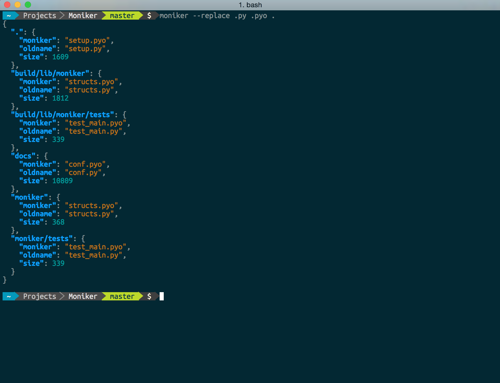

# Moniker
A simple batch file rename tool.

[](https://travis-ci.org/jjangsangy/Moniker) [](http://badge.fury.io/py/moniker) [](https://readthedocs.org/projects/moniker/?badge=latest) [](https://coveralls.io/r/jjangsangy/Moniker)



# Installation

Moniker is a simple Python utility for renaming and manipulating the filesystem based
off similar project and work from [Irving Ruan](https://github.com/irvingruan/Moniker.git).

## Install from PyPi

```sh
$ pip install -r requirements.txt
$ pip install moniker
```

# Usage

```sh
# Default recursive search at current directory
$ moniker --replace .py .py.bak
```

```javascript
{
  ".": [
    {
      "setup.py": "setup.py.bak"
    }
  ], 
  "docs": [
    {
      "conf.py": "conf.py.bak"
    }
  ], 
  "moniker": [
    {
      "__init__.py": "__init__.py.bak"
    }, 
    {
      "__main__.py": "__main__.py.bak"
    }, 
    {
      "__version__.py": "__version__.py.bak"
    }, 
    {
      "moniker.py": "moniker.py.bak"
    }, 
    {
      "structs.py": "structs.py.bak"
    }
  ], 
  "tests": [
    {
      "__init__.py": "__init__.py.bak"
    }, 
    {
      "test_main.py": "test_main.py.bak"
    }
  ]
}

```

## Get Help Instructions
```sh
$ moniker -h

usage: moniker [-h] [-v] [--depth depth] [--replace pat rep]
               [directory]

Simple batch file renaming tool.

positional arguments:
  directory             target directory root

optional arguments:
  -h, --help            show this help message and exit
  -v, --version         show program's version number and exit

  --depth depth         Recursion depth, default is max
  --replace (pat, rep)  File extension patterns

```

